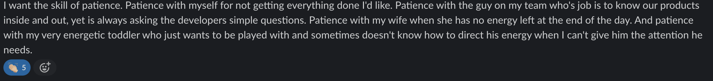
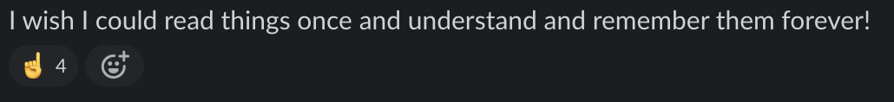
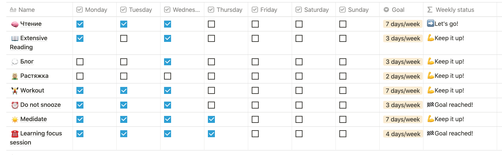
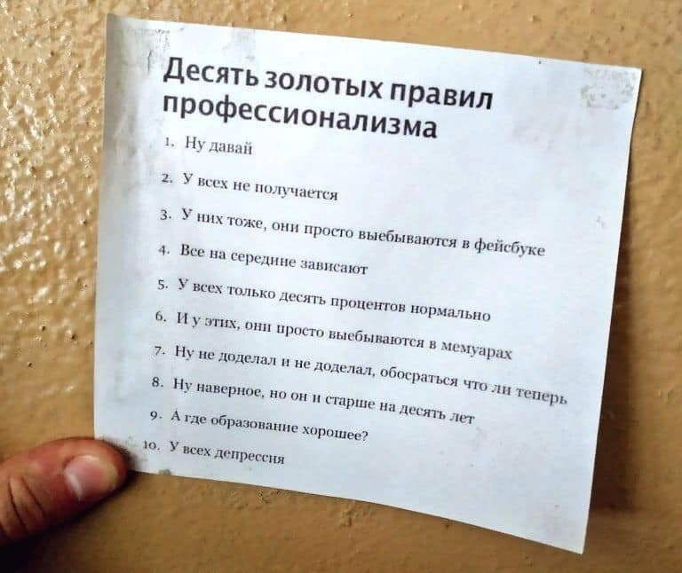

import { SubscriptionForm } from "../../../src/@lekoarts/gatsby-theme-minimal-blog/components/email_subscription";

На днях в одном Slack сообществе американцев, работающих в тех индустрии, провели опрос.

Вопрос был таким "If you could wake up tomorrow with a new skill, what would it be?" (Если бы вы могли завтра проснуться с новым навыком, какой навык это бы был?).

Среди большого количества ответов, я выделил три группы.

Люди хотят:

- успевать больше
- терпения
  
- учиться эффективнее (запоминать с первого раза, мочь держать фокус дольше, и так далее)
  

Про то, [как эффективнее учиться](https://trkohler.com/learn-how-to-learn-online), [лучше запоминать материал](https://trkohler.com/self-education-start) и [научиться держать фокус](https://trkohler.com/social-media-anxiety), я уже писал. Про то, как много успевать, я пока писать не хочу так, как не считаю, что столько сколько я успеваю это "много".

Зато про терпение мне есть что сказать, ведь [я тренируюсь более 200 дней без перерыва](https://trkohler.com/how-to-start-train-and-not-drop), переучился самостоятельно на программиста, и получил 6 сертификатов на курсэре.

В этом посте я расскажу о том, как научиться играть в долгую, не сдаваться и развивать те стороны себя, которые вам хочется.

## Growth mindset и static mindset

Я часто замечаю, что люди склонны давать себе оценку.

Например:

- Я не предприимчивая;
- Я интроверт, поэтому не умею общаться с людьми;
- Я не понимаю математику;
- Искусство — это не для меня, у меня другой тип мышления;

...и так далее.

Так думают время от времени все, и от этого довольно сложно избавиться.

Я предлагаю начать с того, что каждый раз, думая подобные мысли, вы будете добавлять магические слова **ПОКА ЧТО**.

- **Пока что** я не предприимчивая;
- **Пока что** мне кажется, что я интроверт (не умею общаться, не люблю общаться);
- Я не понимаю математику **пока что**;
- Искусство — это **пока что** не для меня;

Это волшебное **ПОКА ЧТО** сильно поменяет вам перспективу. Окажется, что никаких статических, четко предопределенных характеристик у вас нет. Все статические характеристики определены только вашей генетикой, да и то, многие из них могут быть изменены. Цвет волос, например, размер живота или отсутствие/присутствие бороды.

Все остальные характеристики могут быть рассмотрены, как динамические, т.е. они могут меняться с течением жизни, и только от вас будет зависеть хотите ли вы их менять или нет.

Суммируя:

- Вы **пока что** не пробежали марафон
- Вы **пока что** не выучили то, что хотите выучить
- Вы **пока что** не открыли свой бизнес
- Вы **пока что** ужасно готовите все, кроме яичницы

И, знаете что?

Это нормально.

Никто не рождается с умением готовить, как шеф-повар.

У вас есть выбор развивать себя в данном направлении или нет.

## С чем придется столкнуться

Программисты-олимпиадники, художники, марафонцы и другие люди, "талант" которых вы считаете выдающимся, вложили в то, чем они занимаются, очень много времени. Некоторые из них даже не знают как много времени они в это вложили потому что начали заниматься с подачи своих родителей.

Многие из них жертвовали временем на другие сферы развития и, как итог, имеют меньше друзей, чем вы, или варят борщ хуже, чем вы. И, может быть, даже комплексуют по этому поводу.

Время — это наш капитал для инвестирования и каждый распоряжается им по-разному. Пока одни выбирают проводить время с друзьями и тратить деньги на кофе, другие сидят дома и каждый день практикуются в C++ и кофе варят себе сами. В итоге первые будут уметь заводить друзей, лучше, чем вторые, а вторые будут более "талантливыми" программистами и, к тому же, научатся неплохо варить кофе.

То, как вы распоряжаетесь вашим временем — это ваша инвестиция. Если вы инвестируете 10 000 часов в бег, вы будете бегать марафоны. Если 10 000 часов на готовку, вы будете классно готовить. И так далее. Смиритесь с тем, что вам придется инвестировать время и что чем больше времени вы инвестируете во что-то, тем лучше вы в этом станете.

Если вы начинаете бизнес и проваливаетесь, это не означает, что вы неудачник, это означает, что вы пока еще не научились делать бизнес. Начинайте снова и снова, учитесь на практике, а не только на теории, и чем больше у вас практики, тем лучше будет получаться.

**Вам придется инвестировать много времени в то, чем вы хотите заниматься, прежде, чем вы начнете делать это хорошо.**

И не забывайте так же, что...

**Пока вы инвестировали в занятие недостаточно времени, у вас будет получаться посредственно или плохо.**

Первые пару попыток будут неудачными, смиритесь с этим. В этом нет ничего жестокого по отношению к вам, это просто то, как работает опыт. Не нужно быть жестоким к себе и маркировать себя "неудачником" или "бесталанным", если ваши первые картины выглядят хуже, чем картинки ребенка в детском садике.

Мастерство — это марафон, подготовьтесь к нему морально.

## Как найти время

Скорее всего, сейчас ваше время уже распределяется между какими-то занятиями: работой, домом, друзьями и отдыхом. Вы распределяете его согласно вашим необходимостям (без денег жить будет сложнее, чем с деньгами 🙂 ), предпочтениям и уровню энергии.

Для того, чтобы найти время на то, в чем вы хотите практиковаться больше, у вас есть несколько вариантов:

- Оптимизировать время, которое вы тратите на необходимые занятия

**Например**: вы можете не убирать в квартире самостоятельно, а заказывать уборку. Или вы можете не ходить в магазин за покупками, а заказывать доставку. Это прибавит вам энергии и времени, но убавит денег.

- Не тратить время на активности, которые вы любите

**Например**: не встречаться с друзьями или встречаться с ними реже, реже ездить к родителям, реже заниматься детьми, не смотреть сериалы, не пользоваться социальными сетями. Вы знаете, что социальные сети сжирают у вас несколько часов в день?

- Увеличивать период активности

**Например**: вставать раньше или засыпать позже.

- Увеличивать уровень энергии

**Например**: регулярно тренироваться, есть здоровую еду, следить за тем, чтобы не было авитаминоза. Это помогает до определенного предела, но это может так же уменьшать ваш запас времени (вы тратите время на тренировки и приготовление здоровой еды). В этом случае вы не почувствуете заметного эффекта, кроме того, что вы делаете все то же, что и делали, но бодрее.

Скорее всего, если вы взрослый человек, вам потребуется комбинировать все варианты и найти ту комбинацию, которая лучше всего работает именно для вас.

## Составьте себе тренировочный план

Начать тренировать себя чему-то новому — это всегда стресс. Каждый раз, когда я начинаю какую-то новую активность, я помню, что:

- первое время другие активности будут страдать, пока я не привыкну
- у меня не получится сразу интегрировать новую активность в свою жизнь

Я использую вот такой календарь для учета моих регулярных активностей.

Когда вы начинаете учиться чему-то новому, поставьте себе за цель делать это хотя бы два раза в неделю.

Хотите научиться играть на гитаре? ⇒ учитесь 2 раза в неделю

Хотите запустить свой онлайн магазин? ⇒ занимайтесь им 2 раза в неделю

...и так далее.

Скорее всего, первые пару недель у вас не получится делать это так, как вы наметили: 2 раза в неделю. Возможно, в первую неделю вы запойно поработаете над этим 5 дней из 7, а на следующей неделе — всего 1 день. Это тоже нормально, мы все такие. Пытайтесь делать 2 раза в неделю, пока у вас не начнет стабильно получаться.

Если у вас получается заниматься 2 раза в неделю 3 недели подряд, ставьте себе новую цель. Стремитесь к высокому темпу (4-5 раз в неделю), но не слишком высокому — можно быстро выгореть.

## Фокус на процессе и фокус на результате

Я предлагаю сместить фокус с результатов, которых вы хотите достичь, на процессы, которыми вам необходимо заниматься.

Например:

не **я хочу запустить свой проект**, а **я хочу заниматься своим проектом каждый день**

не **я хочу стать иллюстратором**, а **я хочу регулярно рисовать**

Сначала интегрируйте новое занятие в свою жизнь, найдите для него время и пространство, а потом прогрессируйте в своих целях. Более того, вы заметите, что когда вы занимаетесь вашим проектом каждый день, он **будет** расти и приносить вам желаемые результаты.

В процессе изучения и развития ваших идей и проектов распределяйте время таким образом:

- **большую** часть на практику
- **меньшую** часть на теорию
- когда случаются неудачи и ошибки, на работу над ошибками и выводы

## Оценка своего прогресса

Старайтесь не оценивать себя самостоятельно. Скорее всего, если вы только начинаете заниматься чем-то, то у вас недостаточно экспертизы на самооценку, и вы будете скатываться в два состояния: "я никчемный неудачник и у меня нет к этому таланта" и "я гениален, мои идеи восхитительны, сейчас попрет".

Оба эти состояния опасны для вашего прогресса.

Попытайтесь как можно скорее найти наблюдателя со стороны — человека, который опытнее вас в том, чем вы занимаетесь. Попросите его оценить ваш прогресс и указать на слабые стороны. Лучше всего найти таких людей несколько. Не обязательно, чтобы они **учили** вас. Достаточно будет сверки раз в месяц или два, чтобы понимать, что вы не сошли с рельс и двигаетесь туда, куда надо. Чем больше людей, которые могут оценить вас со стороны, тем лучше.

Когда вам кажется, что вы в чем-то плохи, вспомните, что вы:

1. пока еще потратили на это слишком мало времени

2. вряд ли обладаете достаточным уровнем экспертизы, чтобы трезво оценить свой прогресс

3. вы плохи **ПОКА ЧТО**

Бывает, конечно, такое, что вы уже долгое время занимаетесь чем-то и все еще не видите прогресса. Именно потому очень важно быть в контакте с другими людьми, чтобы смочь вовремя узнать, если вы свернули куда-то не туда.

## У вас получится

В это сложно поверить, но у вас получится. Дайте себе время. Если хотите разобраться, начните разбираться и разберетесь. Не судите себя самостоятельно, дайте право оценки тем, кто разбирается лучше вас. Двигайтесь медленно, но постоянно, а не быстро, но с большими перерывами. Не выгорайте, спите и ешьте столько, сколько необходимо. Не пренебрегайте глюкозой, а то будет плохое настроение.

И подписывайтесь на рассылку, если хотите еще добрых текстов от меня.

<SubscriptionForm
  tags={["self-education", "focus skills", "mindfulness"]}
  topic="переосмысливать свои стереотипы"
/>
