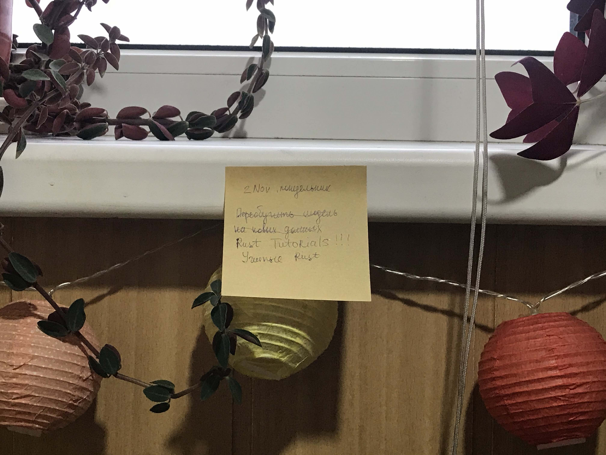
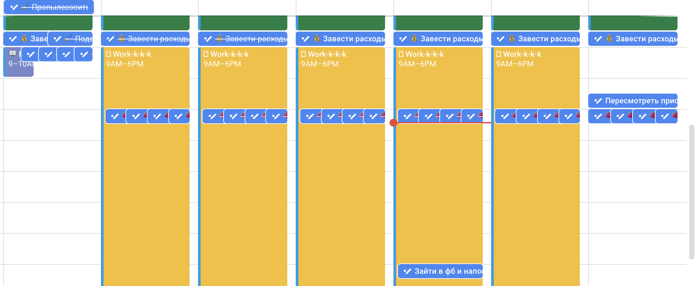
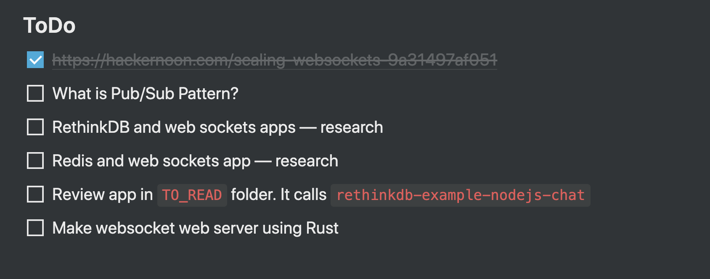
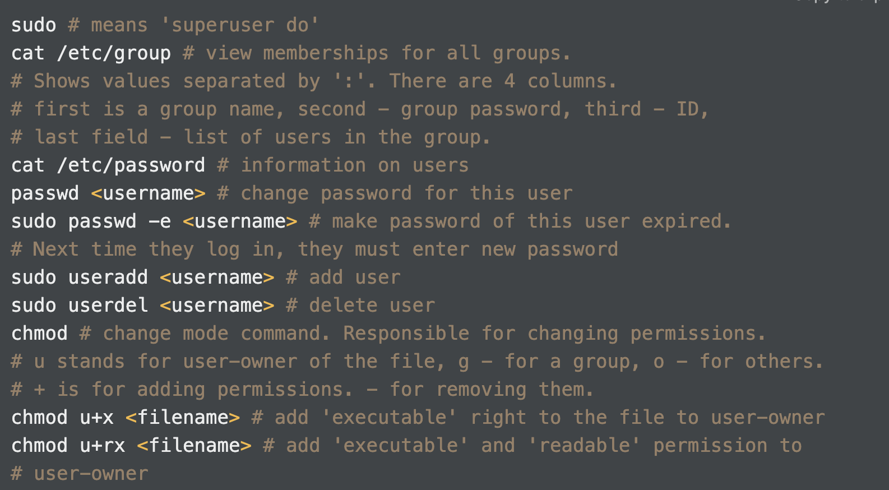

import { SubscriptionForm } from "../../../src/@lekoarts/gatsby-theme-minimal-blog/components/email_subscription";

## Каждый день только одно "Главное"

Каждый день назначайте себе "Главное", связанное с онлайн-курсом или предметом, который вы изучаете. Я купил себе самоклеющиеся стикеры и клею их прямо перед на стену напротив моей головы так, что мой фокус висит целый день у меня перед глазами.

## Все лекции — до среды

Просматривайте все лекции по онлайн-курсу до среды — если у вас курс, который состоит из лекций, задач и недельных дедлайнов.

Я получил 5 сертификатов на Coursera и не пропустил ни одного дедлайна. Все это благодаря тому, что я каждую неделю фокусировался на том, чтобы смотреть **все лекции до среды**.

Даже если на курсе есть какие-то сложные задачи и у вас не будет получаться с ними справиться, то времени с четверга до воскресенья вам точно хватит.

## Дедлайны в календарь

Отмечайте дедлайны в гугл календаре.

Я лично отмечаю все события без исключения и устанавливаю себе всегда два или три напоминания (в зависимости от типа события). Разукрашивайте ваши карточки в разные тематические цвета, чтобы с одного взгляда на день было понятно, что это день дедлайна.

Вот как выглядит мой календарь на эту неделю. Тут дедлайнов нет 🙂

## Задаваться вопросами и назначать себе задачи

Если вы изучаете какой-то предмет из естественных наук, например, биологию, химию или медицину — вам поможет дополнять свои конспекты вопросами, которые возникают у вас по ходу изучения материала.

Если вы такой, как я, и изучаете математику, физику, языки программирования или какие-то другие прикладные науки — придумывайте себе задачи, которыми вы сможете попрактиковать материал.

Вот как выглядит секция дополнительных вопросов/задач в моей лекции по веб сокетам.

## Публиковать свои конспекты

Лучший способ запомнить какой-то материал и классно его изучить — объяснить его так, чтобы понял даже пятилетний ребенок. Превратите ваши конспекты в посты в вашем блоге (отличная мотивация, чтобы его наконец завести 🙂 ), регулярно практикуйтесь в том, чтобы научиться объяснять сложные концепты, которые вы изучаете.

Если вы изучаете программирование, попробуйте составлять cheatsheets: сборник методов или команд, которые помогают решать какую-то определенную задачу.

Вот как выглядит часть моего cheatsheet по линукс командам.

Я объясняю то, что я учу своей девушке — в итоге, она тоже загорелась самообразованием и решила изучить как применяются методы машинного обучения в медицине (она работает врачом).

## Найти того, кто только в начале своего пути, и помочь

Год назад, когда я только начинал изучать программирование сам, я чувствовал себя очень растерянно и глупо, не знал что делать и куда двигаться. Мне тогда очень помог сосед по квартире — оказалось, он был опытным машин лернинг инженером и математиком, пишущим кандидатскую. Он помог мне бесчисленное количество раз: настраивал со мной рабочую среду и дебажил со мной мои первые ошибки.

Теперь, когда я работаю и чувствую, что есть темы, в которых я неплохо разбираюсь, я регулярно выделяю время, чтобы помочь другим знакомым новичкам: отвечаю на вопросы, объясняю, помогаю определить в какой последовательности что учить, куда двигаться.

Это очень заряжает и помогает не бросать.

## Active recall: рекомендация для продвинутых

Выбирайте какой-то один свой конспект каждую неделю и попытайтесь записать его по памяти или рассказать вслух то, о чем он написан. Я обычно ставлю себе задачи подобного типа на пятницу — это не сильно напряженный день на работе, поэтому мой мозг будет готов работать активнее.

Это поможет вам запомнить то, что вы учите, и запомнить это навсегда 🙂 .

## Вставать рано и заниматься с утра

Это рекомендация больше для тех, у кого проблемы с временем и энергией.

Я стараюсь вставать минимум за два часа до начала работы. Так, как я работаю удаленно — мне не приходится тратить время на дорогу, поэтому я, возможно, в лучшей ситуации, чем вы.

Моя девушка работает в лаборатории и пользуется той же техникой, что и я. Так у нас всегда есть минимум полчаса в день, чтобы изучить какой-то материал.

## Выпить кофе перед занятием

Не тратьте силу кофеина просто так — потратьте ее с мудростью. Сделайте это вашим "супер оружием": выпейте чашку кофе сразу же перед тем, как сели за учебу.

_NB: не пейте кофе после двух часов дня, период полувыведения кофеина из организма 5-6 часов. Если вы будете злоупотреблять этим напитком, вы не сможете хорошо выспаться. Скомбинируйте эту рекомендацию с "вставать рано" — и вам не будет равных._

## Съесть шоколадный батончик

Или что-то что вы любите, что содержит сахар.

Эта рекомендация не работает по отношению ко мне — у меня повышенный сахар в крови, но классно работает по отношению к моей девушке.

Мозг любит глюкозу. Понаблюдайте за тем, как вы себя чувствуете, когда используете такую рекомендацию: вам может стать легче держать внимание на предмете, ваши когнитивные способности улучшатся.

Регулярная подкормка шоколадкой в час X поможет закрепить триггер и привычку: когда вы едите что-то вкусное → вы садитесь за работу. Спустя какое-то время, вы автоматически будете приходить в боевой режим после съедения шоколадки.

Главное, не используйте их по другому назначению — иначе не получится выработать такой эффект.

## Назначить саундтрек для ваших занятий

Эта рекомендация подходит, если вы делаете какие-то упражнения, а не слушаете лекции. Например: пишите код, работаете над своим проектом или делаете задачи из учебника.

Найдите какой-то ненавязчивый плэйлист, который не отвлекает вас от работы, и включайте его каждый раз как вы занимаетесь. Спустя неделю регулярных повторений, этот плэйлист станет вашим "боевым саундтреком" и вы будете автоматически приходить в сфокусированное состояние как только включите его.

## Холодный свет над рабочим столом

Четко разграничьте зоны в вашей комнате или квартире с помощью света. Повесьте лампочки теплого света там, где вы отдыхаете, и лампочки холодного света там, где работаете. Холодный свет поможет вам дольше сохранять фокус и "боевое состояние".

_NB: настройте ваш телефон так, чтобы он переключался с холодного на теплый спектр после захода солнца. Перед тем, как вы будете ложиться спать, важно 1,5-2 часа не иметь контакта с холодным светом._

## Податься на финансирование сертификата

Это подойдет вам, если вы занимаетесь на Coursera. Подробнее о том, как это сделать я описал в моем посте [об онлайн-курсах.](https://trkohler.com/%D0%BE%D0%BD%D0%BB%D0%B0%D0%B9%D0%BD-%D0%BA%D1%83%D1%80%D1%81%D1%8B-%D0%BF%D0%BE%D1%81%D0%BE%D0%B1%D0%B8%D0%B5-%D0%BF%D0%BE-%D0%B2%D1%8B%D0%B6%D0%B8%D0%B2%D0%B0%D0%BD%D0%B8%D1%8E) Основная важность финансирования — не сертификат, который вы получите, а задания, которые вы сможете выполнить на оценку. Без практики нет знаний. Старайтесь практиковать ваши знания, как можно чаще.

## Делать все упражнения по теме, которые можете найти

Пока вам кажется, что вы владеете какими-то знаниями недостаточно свободно — ищите задачи и упражнения, которые вы можете сделать. Если вы готовитесь к экзамену, проходите экзамены прошлых лет. Если вы программист и хотите получить работу в американской компании, решайте алгоритмические задачи.

Не изучайте язык программирования просто пассивно перечитывая материал или повторяя за лектором — найдите в интернете задачи для самых-самых начинающих и пытайтесь их одолеть. Попробуйте по одной задаче в день, и держите такой темп на протяжении недели. Если даже одна задача — слишком много и сложно, попробуйте одну задачу раз в 2-3 дня.

## Гуглить все термины, которые не понимаешь

Сделайте так, чтобы в ваших конспектах не оставалось ни одного непонятного вам слова.

Если в лекции какой-то концепт объясняется недостаточно хорошо, ищите материал, где это объясняется лучше. Интернет большой и я гарантирую вам, что вы найдете то, что вам нужно.

Не оставляйте ваши пробелы в знаниях без внимания. Эти дыры потом помешают вам быть уверенным в ваших навыках на 100%.

## Список дополнительных материалов по теме

→ "Думай, как математик" Барбара Окли

→ "Вы, конечно, шутите, мистер Фейнман!" Ричард Фейнман

→ "Найди время" Джейк Кнапп, Джон Зерацки

→ "Сила воли" Роб Баумайстер

→ "Не рычите на собаку" Карен Прайор

→ [How I Take Notes with My iPad Pro in Lectures](https://www.youtube.com/watch?v=n0ql-yeY9u0&feature=youtu.be) (YouTube видео, на английском)

→ [How I ranked first in Cambridge university](https://youtu.be/lzB2DblN6BY) (YouTube видео, на английском)

→ [How I Trained Myself to Study Long Hours](https://youtu.be/Dezbvv2NIlQ) (YouTube видео, на английском)

<SubscriptionForm
  tags={["online-courses", "self-education", "focus skills"]}
  topic="учиться самостоятельно"
/>
