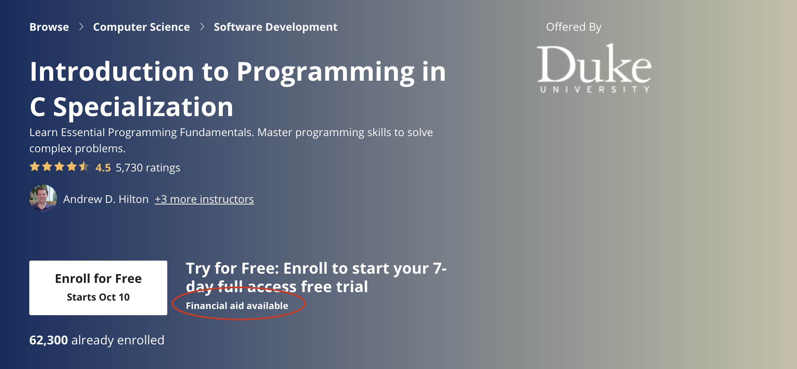
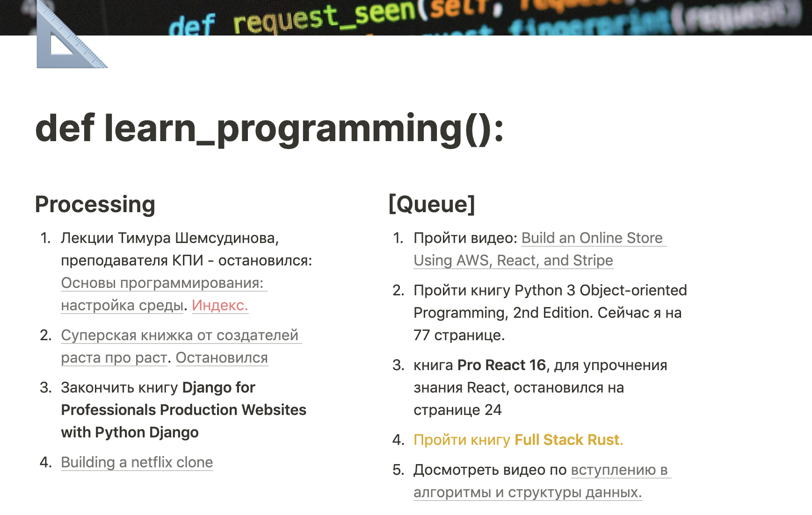
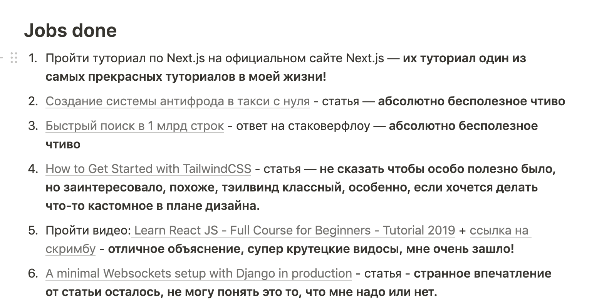
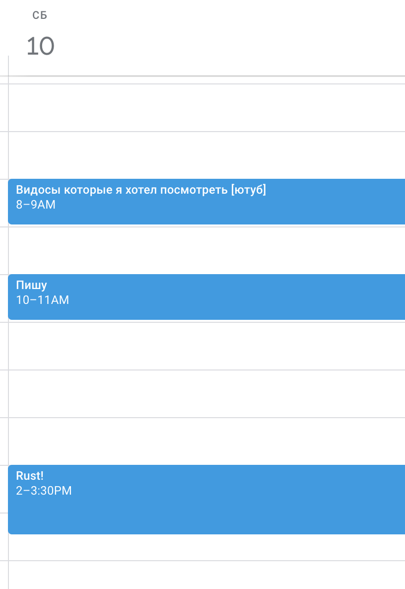

Все было так определенно: встаешь → выключаешь будильник → тащишь себя умываться → кладешь что-то в рот поесть, чтобы не умереть от голода по дороге → собираешь сумку → отправляешься в дальнее плавание в университет...

Когда я учился, мне это казалось непередаваемо сложным процессом — я ненавидел вставать рано. 

Я жил в общежитии в студенческом городке, в 15 минутах ходьбы от корпуса. И, угадайте, что? Я постоянно опаздывал. 

Когда я начал снимать квартиру, до университета нужно было добираться полтора часа на общественном транспорте. Полтора. Бл*ть. Часа.

В итоге, первые пары, как явление, для меня в жизни отсутствовало в принципе. Я ***ненавидел*** ездить в университет. 

Я постоянно засыпал на лекциях — работал до полуночи. Я не мог сосредоточиться и постоянно был голодный. Сил катастрофически не хватало.

Конечно, эти обстоятельства не помогали проникнуться любовью к образовательному процессу.

Пока в моей жизни не появилось ***ЭТО!***

Это...

## Онлайн-образование 😍?

Вставать рано — не нужно.

Ездить никуда — не нужно.

Дедлайнов и контрольных — практически нет, любой дедлайн можно обнулить.

Линейкой по голове гарантированно не получишь.

Хм, — подумал я. — Да это же то, что мне нужно.

True или false?

Рассуждая с позиции человека с пятилетним опытом поиска, прохождения и окончания онлайн-курсов (недавно я получил сертификат университета San Diego по алгоритмам и сертификат Google по компьютерным сетям), я могу точно сказать, что в живых преподавателях эффективности и удовольствия намного больше, чем в потусторонних (по ту сторону экрана я имею в виду, конечно же).

Онлайн-образование — это факинг хард. Особенно, если вы хотите проходить курсы не только начального уровня. 

Нормальные, сложные онлайн-курсы — проходить тяжелее, чем в реальной жизни. И, как оказалось, соблюдать дедлайны **нужно**. Вставать рано тоже **нужно** (об этом далее). 

Правда, не все так печально — если у вас дома есть *рабочее место* и это не ваш кухонный стол, то вам не придется больше тратить время на дорогу, и это хорошая новость. Если же рабочего места нет, я расскажу далее о том, как можно его найти в любом городе на планете (практически). Мой хак поможет вам найти идеальное пространство для самообразования даже в самый разгар пандемии коронавируса, когда все кафехи и другие общественные пространства закрыты, так что — не переключайтесь 🙂

## Подумайте заранее, как совместить вашу жизнь с онлайн-образованием

Ошибка №1 на все времена — вы нажимаете "зарегистрироваться" на онлайн-курсе, вам открывается доступ и вы жадно смотрите все лекции вплоть до первого тестирования. Вы открываете тестирование, убеждаетесь, что оно требует когнитивных усилий, решаете, что наверное "не сейчас", закрываете — и больше никогда не открываете онлайн-курс.

Таких людей — от 60 до 94% учащихся, согласно какой-то статье каких-то исследователей, которую я когда-то читал. Хотите верьте, хотите нет, но до последней недели курса на курсэре добирается в среднем меньше 8% учащихся. 

И это нормально. Это специфика онлайн-образования.

Но вы же, наверное, не хотите быть в числе тех 90%, что сдались в начале, правда? Вы хотите чувствовать себя победителем с воображаемой золотой медалью на груди, который сможет смело говорить самому себе "Я теперь знаю рекурсивные алгоритмы / молекулярную химию / <подставьте сюда ваш предмет изучения> лучше, чем дни рождения своих родителей!". 

И первая моя рекомендация, как человека, который миллион раз был тем, кто бросает в самом начале — подумайте заранее о том, как вписать данный онлайн-курс в вашу будущую жизнь, и определите для себя какие-то базовые принципы, которыми вы будете руководствоваться.

Мои принципы прохождения недели курса на Coursera выглядят как-то так: 

- сначала я открываю посмотреть промежуточное тестирование или задачу
- гуглю основные термины, которые встречаются в этом тестировании или задаче
- пробегаюсь по диагонали по определениям в википедии
- слушаю все лекции (до среды, если курс тяжелый, и до пятницы, если курс легкий)
- оставшееся время трачу на решение задач / промежуточного тестирования. Если задач много, то я решаю обязательно 1 задачу в день, а остальные — по желанию.

Забирайте себе, может, вам тоже подойдет. 

На Coursera еще есть такая штука в некоторых курсах, как *peer asignments* — когда твое решение задачи оценивают другие участники курса. 

Мой совет по этому поводу таков: отправляйте ваше решение не позже четверга вечером, чтобы к понедельнику его точно успели проверить! 

В понедельник будет ваш дедлайн по неделе и будет очень некрасиво, если вы все сделали, а из-за того, что участников на вашем курсе не так уж и много, его не успели проверить, и вы уткнетесь в красный иероглиф где-то на панели курса. Демотивирует! 

**Если кратко, то:**

- сначала подумать о том, как впишите курс в свою жизнь, потом — регистрироваться
- не пытаться посмотреть все лекции запоем
- не откладывать решение промежуточного тестирования на последний день перед дедлайном
- решать по одной задаче в день (если их много и они сложные)
- гуглить материалы по изучаемым вами темам и читать как объясняют их другие люди

## Позаботьтесь о том, чтобы была мотивация закончить

Когда только увидели курс, в голове сразу же: 😍 / 🤓 / 😜 / 😏 . Когда проходишь курс и уже не третьей неделе: 😒 / 😩 / 😴 / 🤬. 

Больше всего у меня лично падает мотивация — когда я не могу проходить тестовые задания или ревью-сессии, а кто-то **может**.

Я чувствовал себя от этого человеком второго сорта и не видел никакого смысла в банальном просмотре лекций с говорящей головой. Знания требуют **практики** для усвоения. 

Поэтому, я рекомендую вам (если вы учитесь на курсэре) подаваться на *спонсорство* вашего сертификата или выбирать *полностью бесплатные курсы* (а не бесплатные только для аудита). Как это сделать? 

Когда заходим на страницу онлайн-курса, ищем вот такую пометку.

Кликаем. Выбираем *"Continue to the application for the course"*. Пишем заявку на английском. Можете посмотреть [о том, как это делается.](https://www.coursera.org/lecture/study-in-usa/the-first-piece-the-application-form-cAlOj)

Через 15 дней вам откроют курс полностью и вы сможете заниматься им как полагается.

После того, как вам его открывают, курсэра берет с вас *обязательство его закончить*. Вы ставите галку (подписываетесь) под этим пунктом. Без него курс не отдадут 🙂 Хитро, правда? Вот я вам и придумал мотивацию. Мне это очень помогло получить мои 5 сертификатов.

Если вы вдруг не закончите какой-то курс, мафия курсэры не найдет вас или ваших родственников и не станет требовать денег. Я вообще не уверен, что они это как-то за этим следят. У меня есть один онлайн-курс, который я не смог пройти с первого раза, и я прохожу его снова, спустя пару месяцев, как бросил. Никто мне не писал никаких гневных писем. 

Еще замечал серьезное падение мотивации, когда не получается с 3-5 раз пройти какую-то задачу или экзамен. 

Я с этим боролся так:

- открывал вопрос на учебном форуме
- гуглил ответ или учебные материалы от других людей, чтобы лучше понять тему
- искал помощи где только возможно
- одолевал задачу любой ценой

Знания придут, а вот если ваша мотивация упадет на уровень абсолютного нуля, то никакая сила в этой вселенной, кроме времени (которое лечит любые раны), не поможет. Берегите свой запал!

**Если кратко, то:**

- выбирайте курсы, где есть практика
- если практика только для платных пользователей, попробуйте податься на полное спонсорство или скидку
- если задача не получается с 3-5 раза, решайте ее любой ценой, спрашивайте о ней кого только можно, пишите на емэйл преподавателю курса

## Не распыляйтесь. Держите фокус

Подступаясь к онлайн-образованию, чувствуешь вдохновение и нетерпение. В интернете столько полезных вещей! Особенно, если вы только начинаете изучать какую-то тему. 

Зайдя только на одну лишь курсэру, я подсчитал около пяти разных курсов по базовому изучению питона. А сколько бесплатных и открытых курсов по реакту? А миллион видео-туториалов на ютубе про юнити или графический дизайн? А еще есть степик, эдэра (для украинцев), курсы лекций разных преподавателей, суперские книжки, которые выкладывают бесплатно в разные телеграмм каналы (тут не будет философских дискуссий о пиратстве).

Одна из самых больших проблем, с которой я столкнулся — это *как в этом бесконечном потоке информации смочь удержать фокус*.

Я решил ее так  — сделал для себя *learning queue* (очередь изучения).

Это сделано в [Notion](https://www.notion.so/). Это полностью бесплатный инструмент, если вы пользуетесь им только для себя. Вроде гибрида трелло, заметок и гугл таблиц. 

Я сделал две колонки: то, что в работе, и то, что в очереди. 

*~~Заголовок страницы является отсылкой к объявлению функций на питоне, такая микро-пасхалка для самого себя.~~* 

Когда я встречаю на просторах интернета очередной туториал, курс или лонгрид, требующий осмысления, я кладу его в **очередь**. Когда я заканчиваю что-то, я перекладываю его в стопку **Jobs Done** и обязательно пишу свое личное мнение или какой-то комментарий, чтобы потом было легче вспомнить что это было и стоит ли его рекомендовать.

Кроме этого, недавно я взял себе на вооружение концепт "фокусировочных сессий". Суть состоит в том, что я заранее определяю себе время на то, чтобы заниматься какой-то конкретной темой и маркирую его себе в календаре. Во время "фокусировочной сессии" нельзя отвлекаться — нужно заниматься только изучением того, что запланировал. При этом, эти сессии не имеют никаких обязательные результатов, суть лишь в том, чтобы сидеть и делать что-либо, не отвлекаясь. 

Вот как это выглядит:

Знаю людей, которые могут проводить четыре сессии по два часа в день с перерывами на 15 минут между каждой. Я так пока не могу, но посмотрим, что будет через полгода тренировок 🙂

Где брать время на образовательные сессии?

 Я, как работающий с 6 до 9 человек, нашел для себя такие решения:

- Встаю в 5:30 утра и после зарядки (в 7) у меня есть полтора часа до работы
- На выходных
- После работы с 18:00 до 19:30

Вот почему я написал в начале о том, что вставать рано все-таки нужно 😉

Я **НЕ рекомендую** помодоро. Возможно, вам с этим удобно, но я заметил, что короткие сессии с частыми перерывами сильно выбивают меня из колеи, и мне сложно вернуться в прежнее состояние глубокой сфокусированности. Мне больше подходят длительные сессии, особенно, если я занимаюсь чем-то сложным — например, курсом по каким-нибудь графовым алгоритмам.

Чтобы во время сессий меня ничего не отвлекало, я оставляю телефон в другой комнате и предупреждаю свою девушку о том, что не надо заходить в рабочую комнату в определенные периоды времени. 

Натренировать умение фокусироваться мне помогают ежедневные медитации. Для этого я пользуюсь [Headspace](https://www.headspace.com/), но можно и без него. Просто это приложение мне очень понравилось.

**Если кратко, то:**

- Не берите в работу больше 3-4 образовательных материалов одновременно — это включает в себя онлайн-курсы, туториалы, лонгриды и все, что требует вашего внимания и вовлечения больше, чем на 2 минуты
- Сделайте себе *learning queue,* добавьте эту страницу в закладки своего браузера, пусть она будет всегда для вас на самом видном месте
- Во время учебы оставляйте телефон в другой комнате
- Планируйте образовательные сессии и их время заранее, чтобы морально себя подготовить к тому факту, что четыре часа в воскресенье (например) вы потратите на ваше образование
- Предупреждайте и согласовывайте ваши образовательные сессии с близкими
- Начинайте с малого: пусть ваши первые сессии будут 30-60 минут. Дайте себе привыкнуть. Если у вас проблемы с вниманием и у вас есть зависимость от социальных сетей, попробуйте начать практиковать медитации на регулярной основе.

## Рабочее место (бонус)

Наличие рабочего места — это безусловная привилегия. Далеко не у всех оно есть, а если и есть, то не у всех оно изолированное и находится в отдельной комнате. 

Когда мы искали квартиру с моей девушкой, мы заранее знали, что нам нужна будет обязательно еще одна изолированная комната. Ее квадратура не имеет значения, главное, чтобы закрывались двери. 

Наличие такой комнаты серьезно меняет семейную жизнь. Когда мы жили в однокомнатной квартире — учиться было практически невозможно. Я искренне считаю, что лучше иметь квартиру дальше от центра, но с отдельной комнатой для работы, чем ближе к центру, но без нее.

Однако, все это не отменяет того, что у вас этого может не быть, и менять квартиру ради онлайн-курсов вы не будете 🙂

Мое решение на это — **библиотеки.**

Я самый большой фанат библиотек, у меня есть самая полная карта библиотек Киева — их более сотни. Я люблю находить маленькие библиотеки с кучей иностранных книжек, люблю общаться с библиотекарями и оставлять им донаты. Когда я был студентом и мне нужно было делать курсовую или готовиться к экзамену, библиотека спасала мне жизнь. 

Я очень рекомендую вам найти ближайшую к вашему дому библиотеку — не важно детскую или взрослую, и сходить туда в гости. Там 100% есть читальный зал, в котором могут читать и заниматься кто угодно. Скорее всего, там еще и будет интернет, а если нет — вы можете раздать его себе с телефона.

Ваши районные библиотеки могут стать избавлением от ваших головных болей, и ваши дети // жены // мужья // свекрови не будут сидеть у вас на ушах, пока вы будете учиться в тишине и спокойствии в вашем новом храме знаний.

Не забудьте поблагодарить библиотеку, оставив им донат. Многие из них сейчас находятся в очень плачевном состоянии, и любая лишняя копейка им не повредит. Но, если у вас ситуация тоже не очень, библиотека никогда не потребует с вас денег, она всегда будет вам рада, вне зависимости от вашего финансового состояния.

Это моя любимая библиотека в Киеве — библиотека Шевченко. Есть еще классная американская, польская, медицинская и техническая. 

**Если кратко, то:**

- Изолируйте себя, когда учитесь
- Найдите близкую к вашему дому библиотеку

## Список литературы на лето

Что еще можно почитать  или посмотреть по теме, если очень хочется?

→  [Видео на английском. Если вы знаете язык, то я его очень рекомендую](https://youtu.be/3NSkk31vFbU)

→ Книга "Думай, как математик" Барбары Окли. Она достойна того, чтобы вы потратили на нее деньги. Я читал ее в оригинале, но думаю, что и на русском она будет неплоха.

→ Книга "Вы, конечно, шутите, мистер Фейнман!" Ричарда Фейнмана. 

→ Книга "Контур жизни" Яу Шинтуна — автобиография блестящего современного математика из очень бедной китайской семьи.