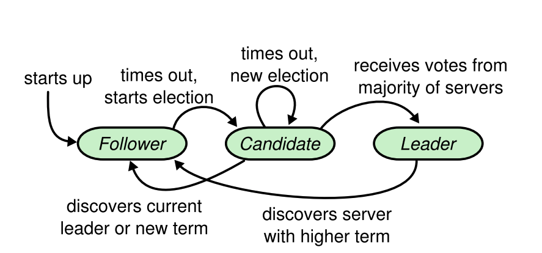

import { SubscriptionForm } from "../../../src/@lekoarts/gatsby-theme-minimal-blog/components/email_subscription";

Raft — алгоритм для достижения согласия (консенсуса) в распределенных системах, авторства Diego Ongaro и John Ousterhout, разработанный в университете Стенфорда. Этот алгоритм был разработан для того, чтобы заменить **Paxos** и **multi-Paxos** на более понятную, но не в ущерб эффективности альтернативу.

_Имена авторов я не перевожу нарочно — не хочу случайно перевести их некорректно. В материале так же, возможно, будут содержаться англоязычные термины, и я заранее прошу прощения за это. Аналоги многих из них незнакомы мне на русском языке так, как я не изучал никогда software engineering по русскоязычным источникам._

### Откуда потребность в алгоритмах достижения согласия?

В распределенных системах с большим количеством машин-участников (нод) вероятность того, что по крайней мере одна из нод вышла из строя, очень высока. Алгоритмы консенсуса были разработаны для того, чтобы ноды могли спокойно пережить потерю одно из своих участников и функционировать далее без потери данных.

Долгое время Paxos был самым популярным алгоритмом, которые использовали для того, чтобы решить данную проблему. Многие студенты (по крайней мере в US) изучали его, как наиболее рекомендуемое решение.

Paxos сложный для понимания и требует много доработок для того, чтобы работать в настоящих системах. В результате, и студенты, и системные архитекторы мучились с его изучением и имплементацией. Авторы Рафта признаются, что сами решились работать над Рафтом только после того, как как следует намучились с Paxos 🙂

Рафт намного проще для понимания потому, что он базируется на понятиях, доступных для понимания любому человеку: лидерах, последователях, выборах и так далее.

Предлагаю вам самим ознакомиться и сделать выводы насколько он понятный 🙂

## Основные концепты Рафта

### Единственный лидер

Строгое лидерство означает, что в системе существует максимум один лидер. Всегда. Может не быть лидеров совсем, но больше одного быть не может.

Рафт использует строгую систему назначения лидерства. Это связано с brain-split — опасным состоянием системы, в котором все идет к чертям.

_Говорю в голове "к чертям", и сразу же стройный хор голосов начинает петь пиратские песни, "йо-хо-хо", отчаянно хочется открыть свой несуществующий погреб и достать оттуда бочонок рому..._

Долой лирические отступления!

_Brain-split_ — состояние распределенной системы, в которой несколько нод думают, что они лидеры, и, следовательно, ведут себя согласно лидерскому паттерну.

В Рафте состояние _brain-split_ наступить не может, и это предопределено дизайном алгоритма.

Строгое лидерство так же обеспечивает надежность ведения лога. Лог играет важную роль для имплементации _replicated state machines_.

### Выборы

Для того, чтобы проводить выборы нового лидера в случае ~~грехо~~падения предыдущего, используется система таймеров, которая помогает легко разрешать конфликты. За лидера должен проголосовать _кворум_ нод — большинство нод в системе.

### Replicated state machines

Replicated states machines — это подход, в котором все ноды в системе копируют одно и то же состояние. Даже если какая-то нода вышла из строя и потом снова восстановилась, ее состояние будет точно таким же, как и у остальных нод в системе. Этот подход используется для того чтобы распределенная система была более устойчива к падению отдельных нод. Если одна или несколько нод выйдет из строя, это не нарушит систему.

Replicated state machines обычно используют лог, чтобы нода восстанавливала из него состояние. Именно потому очень важно, чтобы лог был в полном порядке. От него зависит состояние всех машин в системе.

### Последователь

Последователь — это нода, которая слушается лидера. Она ведет довольно пассивный образ жизни.

### Срок

Лидера выбирают на определенный срок. Срок используется в качестве _логических часов_ в Рафте.

### RPC

RPC — remote procedure call. Способ, который используют ноды, для коммуникации друг с другом.

## Взаимодействия в Рафте

Изменение состояний в Рафте чем-то мне напомнило игру в мафию и микро-модель римской империи одновременно.

Вот как все это происходит (если в двух словах):

1. Как только нода просыпается, она автоматически попадает в состояние последователя вне зависимости от того, какой статус у нее был перед тем, как она заснула.
2. Когда нода-последователь не слышит указаний от лидера какое-то время, она делает вывод, что нода-лидер заснула и переходит в состояние кандидата в лидеры.
3. Когда нода-кандидат получает достаточное количество голосов от кворума, нода переходит в состояние лидера, в котором она находится пока не заснет.
4. Когда нода-кандидат обнаруживает другую ноду-кандидата с более поздним сроком, она автоматически переходит снова в состояние последователя и снимает себя с кандидатства.
5. Если нода-кандидат не получает достаточное количество голосов за определенное время, она повторяет процесс выдвижения себя в кандидаты заново.
6. Как только нода-лидер обнаруживает, что в системе наступил новый срок, она сразу же переходит в состояние последователя.

Имплементацию алгоритма можно условно разделить на 9 частей:

- инициализация
- голосование за нового лидера
- сбор голосов
- рассылка сообщений от лидера
- дублирование лога от лидера последователям
- получение сообщений последователями
- обновление лога последователей
- лидер получает подтверждение на свой лог
- лидер делает _коммит_ лога

Если вас интересует псевдокод имплементации каждой из частей, я рекомендую вам ознакомиться с [лекцией Мартина Клеппманна, в которой он как всегда восхитительно излагает материал](https://youtu.be/IPnesACYRck).

## Дополнительные материалы

Авторы отмечают, что это "наиболее понятный алгоритм консенсуса, который существует на данное время". Я думаю, вы убедились в этом самостоятельно, воображая себе в голове этот эффективный и надежный переход власти в системе нод, описанный мной выше.

Если вам не хватило моего короткого объяснения, я рекомендую почитать [оригинальную публикацию авторов "In Search of an Understandable Consensus Algorithm"](https://www.usenix.org/system/files/conference/atc14/atc14-paper-ongaro.pdf).

И не забудьте про [лекцию](https://youtu.be/IPnesACYRck)! Под лекцией есть ссылка, где можно скачать слайды с псевдокодом.

Если вы нашли опечатку или ошибку в тексте, или вам кажется, что вы можете дополнить материал чем-то, открой пулл реквест в [репозитории этого блога](https://github.com/trkohler/blg).

Если вы просто хотите поругаться и выразить собственное неудовлетворение (или удовлетворение) этим материалом, ругайтесь в [мой линкедин](https://www.linkedin.com/in/trkohler/).

И подписывайтесь на мою рассылку, если вы тоже интересуетесь проектированием распределенных систем 🙂

<SubscriptionForm
  tags={["self-education", "start career in IT without formal education"]}
  topic="учиться новому"
/>
