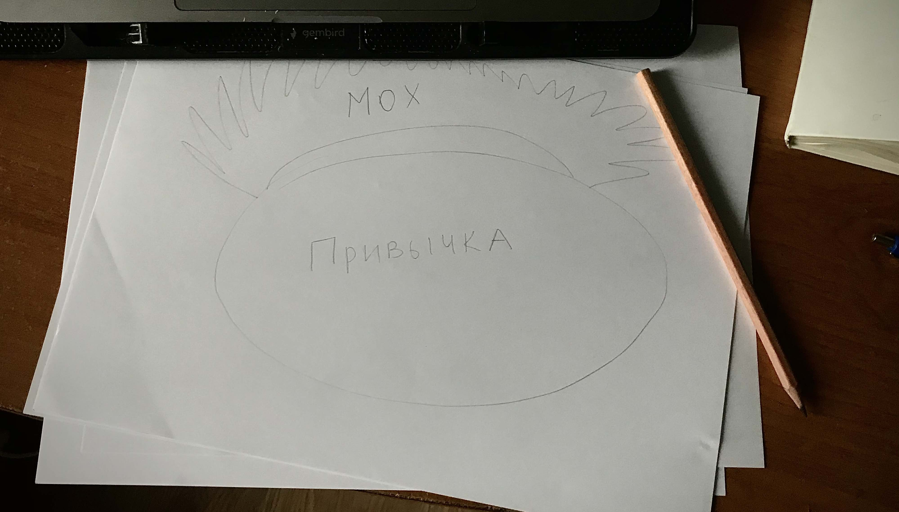

Про личные дневники (journaling, note taking) написано очень много. Однако этот факт не помешал тебе добраться до этого материала и это значит — мне все еще есть что тебе сказать. Я не хочу давать рекомендаций или поучений и я уверен, что у меня нет права это делать — я не профессиональный журналист, не исследователь продуктивности и не мотивационный коуч. Но я буду рад рассказать мою историю — такого же человека, как ты, только из интернета.

Я начал вести свой дневник совсем не потому что видел в этом какую-то пользу для саморазвития. 

## Как письмо помогает учиться

Еще с четвертого класса у меня сформировалось стойкое сопротивление излагать *очевидные* вещи на бумагу. Смысл *выписывания* появился лишь с появлением **сложных задач** — нужна была дополнительная оперативная память. Таким образом, письмо приобрело у меня стойкую ассоциацию с процессом сложных вычислений или решения каких-то комплексных задач, которые требуют дополнительных объемов памяти. 

Повзрослев на пару классов, я заметил, что, когда я пишу что-то - основные тезисы из учебника, например, — я проговариваю это про себя и это помогает мне обдумать все еще раз*.* То, что я записывал, я лучше понимал и не столько благодаря механической памяти (рука совершила какое-то усилие, а мы склонны больше ценить то, к чему мы прикладываем усилия), сколько благодаря вот этим мысленным повторениям, которые как будто пропитывались моими собственными мыслями с разных сторон. 

В университете я часто *письменно размышлял* на экзаменах или контрольных работах. 

Я вырывал черновой листок и выписывал разные мысли, перескакивал с задачи на задачу. Мои выписанные промежуточные вычисления всегда помогали мне вернуться и быстро въехать в контекст. Мне сложно было представить себя без листка бумажки, он стал моим самым надежным средством.  Сначала я выписывал то, что всплывало в голове по теме в хаотичном порядке, потом переключался на другую задачу, потом возвращался, пытался выписать еще что-то или связать предыдущие мысли в что-то более-менее понятное. Так у меня получалось на любой вопрос дать хоть какой-то ответ, даже если я совсем его не знал или не учил. 

Во взрослой жизни сложные вычисления у меня очень мало. Экзаменов больше нет, все вопросы можно загуглить. Моя привычка покрылась мхом. Изредка я обращался к ней во время собеседований.

## Ведение дневника и самообразование

Когда я начал [учиться самостоятельно](https://trkohler.com/tags/%D0%BE%D0%BD%D0%BB%D0%B0%D0%B9%D0%BD-%D0%BA%D1%83%D1%80%D1%81%D1%8B), мое желание портить бумагу вспыхнуло с новой силой. Я купил себе толстую тетрадь в клетку и на кольцах. Надеялся, что это будет мой конспект, но в скором времени осознал, что конспекта не выйдет - тетрадка превратилась в "мусорную". Я использовал ее строго для ~~творческого~~ процесса решения задач и бессвязных размышлений. Читать в ней было нечего.

Тогда я купил себе еще одну тетрадь, на этот раз — белый молескин в линейку. Я надеялся, что мне станет жалко его портить.

Чуда не произошло: первые десять страниц у него испорчены бессмыслицей. Мне стоило огромных усилий отучить себя от порчи всех тетрадей и портить только одну — мусорную.  Спойлер: молескин остался в живых.

Время для него пришло немного позже. В моей жизни случилась беда — врач назначил мне пить таблетки каждый день три раза в день до конца моих дней. У меня выявили высокий уровень сахара в крови. 🙂  

## Дневник и ежедневные задачи

Никакого удобного мобильного приложения для записи того, сколько я принимаю колес, я не нашел, и в ход пошел мой молескин. Я начал писать туда о таблетках. 

Промежуточные вычисления задачи, но на новый лад. Привычка закрепилась.

В какие-то дни я мог чем-то очень сильно разозлиться или о чем-то сильно загрустить. У меня не всегда была возможность сходить к терапевту и рассказать ему об этом, а чувства захватывали с головой. Так у молескина появилось еще одно применение — свалка для моих эмоциональных наплывов. Я мог в него материться, истерить, писать любые глупости, размышлять о вечном — и никто этого не видел и не мог бы посмотреть на меня, как на сумасшедшего. 

Кайф — подумал я.

Так продолжалось достаточно долго. У меня было много пустых записей, где были только даты и таблетки и были редкие с кучей мыслеотходов, от которых никакой пользы будущему мне, конечно же, не было, но была очень весомая польза мне настоящему.

Потом таблетки поменялись на количество тренировочных подходов. [Я начал тренироваться каждый день.](https://trkohler.com/%D1%8F-%D1%82%D1%80%D0%B5%D0%BD%D0%B8%D1%80%D1%83%D1%8E%D1%81%D1%8C-250-%D0%B4%D0%BD%D0%B5%D0%B9-%D0%B1%D0%B5%D0%B7-%D0%BF%D0%B5%D1%80%D0%B5%D1%80%D1%8B%D0%B2%D0%BE%D0%B2-%D0%BA%D0%B0%D0%BA-%D0%BD%D0%B0%D1%87%D0%B0%D1%82%D1%8C-%D1%82%D1%80%D0%B5%D0%BD%D0%B8%D1%80%D0%BE%D0%B2%D0%B0%D1%82%D1%8C%D1%81%D1%8F-%D0%B4%D0%BE%D0%BC%D0%B0-%D1%81-%D0%BD%D1%83%D0%BB%D1%8F) 

Если просмотреть мой дневник, то станет видно, что я не пропускал ни дня, начиная с определенной даты. Это очень помогает мне чувствовать мой прогресс. Я начал просматривать прошлые записи: как изменялся почерк, которым я записывал упражнения, сколько раз я делал определенное упражнение. Когда я делал меньше, чем хотел, я оставлял комментарий в стиле "у меня сегодня была бессонная ночь" или "жутко болела голова, таблетка не помогла". Это добавило мне информацию о том, как часто у меня бывают мигрени и позже — помогло понять когда они совершенно прошли.

В добавлении к тренировкам я начал записывать дни на кето-диете. 

Дальше — вставание в 5 утра, медитация, книга, которую я читаю прямо сейчас, как я себя чувствую (последнее я начал писать только потому, что после медитации был довольно расслаблен и не хотел начинать тренировку сразу же — поэтому придумал себе такую микро-прокрастинацию: писать как у меня дела).

Недавно — записал первый микро-контракт (это что-то вроде договоренности с самим собой). Выписывание на бумагу помогает мне не нарушать. В микро-контракте я всегда прописываю вознаграждение, которое получу за успех.

## Организация и поиск важных заметок

Чтобы было удобнее искать самые важные мысли, я помечаю их себе закладками. Так у меня закладки поделены на четыре группы: **"лично-социальное"**, **"письмо"**, **"технические"** и **"заметки с терапевтической группы"**. Когда начинаю какую-то новую важную мысль, даю ей подзаголовок и подчеркиваю маркером. Так проще сканировать страницы, когда ищешь что-то конкретное.

Обрастал всем постепенно, по мере необходимости. Начинал с малого: учета таблеток.

## О ведении дневника от других людей

Видео Тима Ферриса, которое я прикрепляю чуть ниже, помогло приобрести более стойкую мотивацию не бросать дневник и культивировать эту привычку. Оно на английском, но он очень хорошо и подробно рассказывает про свои способы ведения дневников. Мне очень зашла его идея про покет-бук — маленькую записную книжку, которую можно носить в кармане. 

<iframe width="560" height="315" src="https://www.youtube.com/embed/UFdR8w_R1HA" frameborder="0" allow="accelerometer; autoplay; clipboard-write; encrypted-media; gyroscope; picture-in-picture" allowfullscreen></iframe>

Чтобы дать напоследок пищу для размышлений и не оставлять с пустыми руками, прикладываю список статей (русскоязычных!), которые показались мне интересными и хорошо написанными:

- [Тут мне понравилось про метод Прогоффа (я о нем никогда не слышал)](https://www.wonderzine.com/wonderzine/life/life/214505-journal-therapy)
- [Интересный ракурс с терапевтической точки зрения и много выписок из разных интересных персонажей типа Сартра и Пикассо](https://newtonew.com/lifehack/how-to-keep-a-diary)
- [Перевод статьи на эту тему какой-то важной американской мадам](https://vc.ru/life/73498-pyat-pravil-samopoznaniya-kak-vesti-dnevnik-s-polzoy)