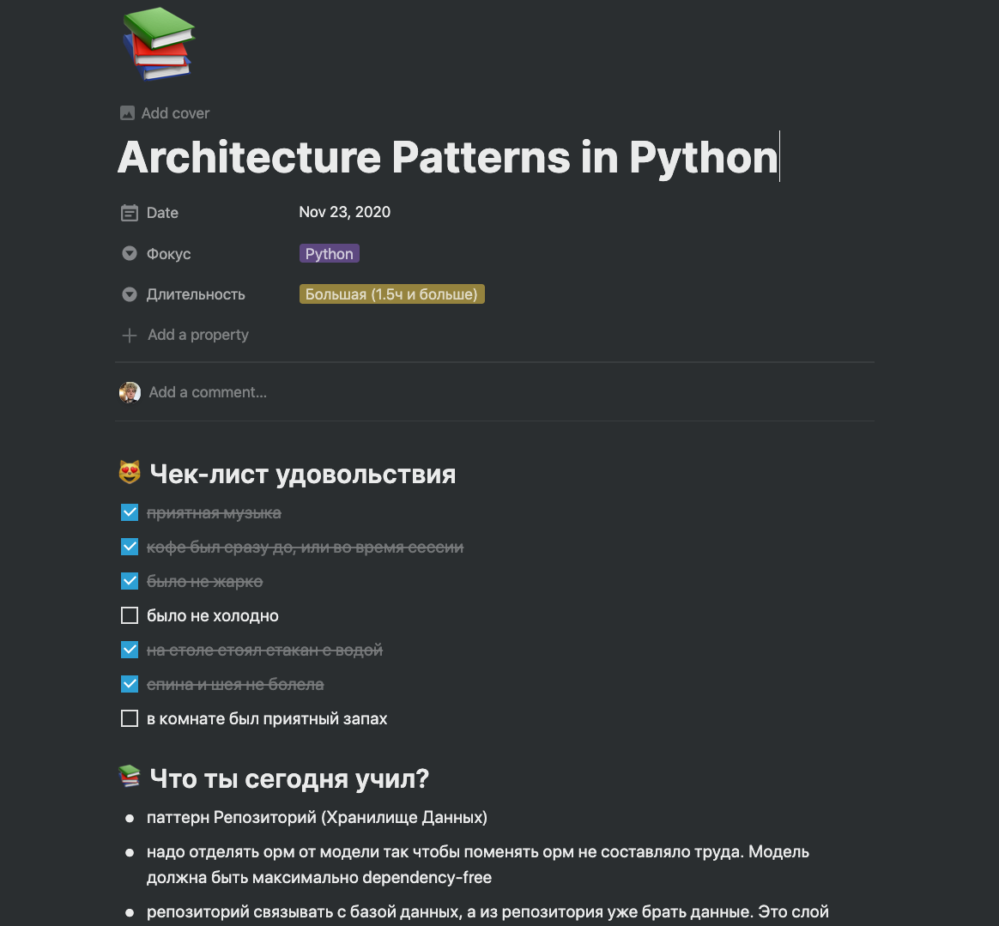

import { SubscriptionForm } from "../../../src/@lekoarts/gatsby-theme-minimal-blog/components/email_subscription";

Привет, рад, что ты тут 👋

В этом посте будет о таком:

- Cколько времени нужно тратить на самообразование, когда только начинаешь — много или мало? сколько конкретно (в минутах) ?
- Какие методы помогают информации остаться в голове, а не забыться и пропасть зря — учить на память, как стих? писать конспект? что рекомендуют британские ученые?
- Как превратить учебу в привычку? возможно ли это?
- Как наблюдать собственные результаты? за чем нужно следить? как можно понять эффективно ли то, что я делаю?

## Сколько нужно тратить времени на учебу?

У людей, ориентированных на результат, метрика _времени_ часто является ключевой: чем больше времени потратил на учебу, тем более достоен поощрения (со своей стороны). Среди взрослых людей это явление проявляется в форме _трудоголизма._

Важно отметить, что продолжительность учебной сессии может влиять как положительно, так и отрицательно на эффект от обучения. Слишком длительные, запойные сессии могут сказаться плохо на результатах в долгосрочной перспективе.

Для людей, которые только начинают учиться самостоятельно, я бы порекомендовал начинать учебные сессии в 15-20 минут. Если получается больше — хорошо, но не обязательно. Не давите на себя с временем. Если вы 2 раза сможете учиться по несколько часов, а потом не сможете учиться неделю — результаты будут намного хуже, чем если бы вы учились 3 раза по 15-20 минут регулярно, соблюдая строгий еженедельный ритм.

Культура самообразования, как культура питания — если вы сядете на жесткую диету, то не продержитесь долго. Или продержитесь, но потом на радостях начнете есть еще больше и вернете себе прежний вес.

Не надо диет и не надо учебных запоев.

Когда у вас получится регулярно делать маленькие учебные сессии, попробуйте делать одну сессию по часу, а две другие оставить в прежнем временном диапазоне.

Когда у вас получится три недели в таком режиме, попробуйте сделать либо четыре сессии в неделю, либо поднять временной диапазон всех сессий до часа (ваше развитие в ваших руках, но будьте внимательны и не теряйте прежние результаты).

Если вы чувствуете, что сдаёте позиции, вам лучше откатиться на уровень назад и попробовать задержаться на нем подольше. Регулярность — самый важный параметр для новичка, вам нужно его сохранять любой ценой.

## Как сделать самообразование привычкой?

Учеба традиционно ассоциируется не с самыми приятными ощущениями: жесткий свет от лампы, глаза сухие и красные от долгого чтения с экрана, болит шея или спина, постоянно отвлекают соседи по комнате или семья, температура в комнате может быть слишком низкая или высокая — обычно мы этого не замечаем, но, находясь без активного движения в течении получаса, это сказывается на нашем самочувствии. Для того, чтобы самообразование превратилось в привычку, вам нужно позаботиться о том, чтобы добавить в этот процесс регулярное положительное подкрепление (как будто вы тренируете хомячка 🙂 ).

Для этого я сделал себе чек-лист удовольствия от учебы. Перед началом учебной сессии я стараюсь заполнить все пункты:

- приятная музыка в наличии
- кофе в наличии
- не жарко
- не холодно
- приятно пахнет в комнате (иногда зажигаю себе свечи с запахом или арома-палочку)
- на столе стоит стакан с холодной водой
- стул, стол, техника, книги расположены по возможности так, чтобы я смог сидеть все время ровно
- телефон лежит достаточно далеко и включен беззвучный режим

Попробуйте составить ваш чек-лист удовольствия. Что могло бы поддержать вас в процессе? Что вы любите?

Если вам сложно придумать, чем можно подкрепить себя, попробуйте подумать о том, как снизить уровень раздражения.

Если вы любите заниматься в тишине и не можете сосредоточиться, когда рядом говорят соседи, вы можете попытаться договориться с ними о каком-то невербальном сигнале, который будет означать, что вы просите их быть потише. Например, когда вы надеваете наушники.

Следите за температурой в комнате и влажностью. Когда глаза краснеют, это может значить, что вам нужны увлажняющие капли или увлажнитель воздуха. Позаботьтесь о своем теле, и тело в ответ начнет поддерживать ваши стремления учиться.

## Как запоминать то, что учишь, эффективнее?

Для того, чтобы лучше запоминать, есть два отличных метода:

- active recall ("активное вспоминание")
- spaced repetitions("повторение материала через время")

Я не буду вдаваться в подробности того, как это работает, а только опишу суть. Если вы захотите подробнее изучить научную обоснованность этих методов, я рекомендую вам прочитать книгу из списка рекомендуемых материалов по теме под постом.

### **Активное вспоминание**

Суть состоит в том, что нужно рассказать или записать то, что ты только что учил. Можно рассказывать самому себе — обычно все так и делают.

Когда начинаешь вспоминать, оказывается, что какая-то информация совсем не отложилась в памяти. Тогда можно ее еще раз изучить — и снова повспоминать.

Подсматривать во время вспоминания нельзя. С подсматриванием будет уже не активное вспоминание, а пассивное перечитывание 😄

### **Повторение материала через время**

Суть состоит в том, что не стоит учить один и тот же предмет (или тему) каждый день. Лучше делать это раз в 2-3 дня, а когда уже выучили — повторять раз в 2-3 недели.

Если вы будете регулярно запрашивать информацию по одной и той же теме из ваших чертогов разума, у вас сформируются более устойчивые нейронные связи. Это обеспечит качественное запоминание темы.

## Как прогрессировать в своем навыке учиться самостоятельно?

То, что нельзя измерить, нельзя улучшить, сказали бы мои знакомые продуктовые менеджеры. И были бы правы.

Я выделяю несколько ключевых параметров, которые можно использовать для определения прогресса: регулярность — параметр, характеризующий _процесс_, и эффективность — параметр, характеризующий _результат_.

Эффективность — очень субъективная и сложная для измерения метрика в контексте самообразования. Пока у меня нет четких рекомендаций по поводу того, как ее измерять. Если у вас есть идеи по этому поводу, я буду рад, если вы мне напишите о вашем опыте на почту.

Если у вас есть какие-то экзамены или аттестации, то оценки по ним могут отлично подойти. Если вы студент заочной формы обучения и ваш средний балл на последней сессии — в районе 70, то показателем эффективности вашего обучения будет средний балл 80 на следующей сессии, 90 — на сессии за ней, и так далее.

Для себя я выбрал работать над регулярностью. Для этого я использую календарь и собственные записи в дневнике.

Каждый раз, когда я занимаюсь, я отмечаю _длительность_ сессии, заполняю _чек-лист_ удовольствия, пишу _тему_, которую изучал. После того, как заканчиваю, по памяти пытаюсь восстановить что я учил.

Это выглядит примерно так.

Если вы пользуетесь Notion, вы можете скопировать мой шаблон и пользоваться им.

→ [Ссылка на шаблон с чек-листом](https://www.notion.so/Architecture-Patterns-in-Python-e5137751da2147aa871fa4e1c536eac7)

### Воскресенье — подведение итогов и аналитика

Каждое воскресенье я делаю обязательный выходной и подвожу итоги. Чем больше данных удалось собрать за неделю (сколько я учился, как часто, с какой продолжительностью, как приятно было в процессе, и так далее), тем проще и качественнее проходит анализ.

Я выявляю свои слабые места (например, сессии были слишком редкие) и выдвигаю гипотезы о том, как можно это поменять (например, если я поменяю свое расписание определенным образом, то, теоретически, времени на учебу должно стать больше). Всю следующую неделю я фокусируюсь на том, чтобы протестировать мою гипотезу (меняю свое расписание).

Слабое место → гипотеза о том, как это исправить → проверка → результат или его отсутствие → ...

Этот принцип работы над ошибками очень напоминает то, что называется _научным методом_. Вы изучаете себя, и вы — руководите собой. Я очень люблю рекомендовать этот принцип, он неоднократно выручал меня в разных ситуациях. Верю, поможет и вам!

## Заключение

Создайте свою систему. Научитесь измерять ваш _процесс_ или _результат_. Будьте постепенны. Лучше меньше, но регулярно, чем редко, но много. Меняйте темы, которые изучаете, не изучайте одну и ту же тему несколько дней подряд. Старайтесь использовать "активное вспоминание" почаще.

Этот пост сделан в поддержку моей серии постов о том, как учиться самостоятельно.

Если ты захочешь ознакомиться со всеми постами из этой серии:

→ [15 рекомендаций по самообразованию](https://trkohler.com/%D0%BA%D0%B0%D0%BA-%D0%BD%D0%B0%D1%83%D1%87%D0%B8%D1%82%D1%8C%D1%81%D1%8F-%D1%83%D1%87%D0%B8%D1%82%D1%8C%D1%81%D1%8F-%D0%BE%D0%BD%D0%BB%D0%B0%D0%B9%D0%BD-%D0%B2-2020-%D0%B3%D0%BE%D0%B4%D1%83-15-%D1%80%D0%B5%D0%BA%D0%BE%D0%BC%D0%B5%D0%BD%D0%B4%D0%B0%D1%86%D0%B8%D0%B9-%D0%BF%D0%BE-%D1%81%D0%B0%D0%BC%D0%BE%D0%BE%D0%B1%D1%80%D0%B0%D0%B7%D0%BE%D0%B2%D0%B0%D0%BD%D0%B8%D1%8E)

→ [Онлайн-курсы. Пособие по выживанию](https://trkohler.com/%D0%BE%D0%BD%D0%BB%D0%B0%D0%B9%D0%BD-%D0%BA%D1%83%D1%80%D1%81%D1%8B-%D0%BF%D0%BE%D1%81%D0%BE%D0%B1%D0%B8%D0%B5-%D0%BF%D0%BE-%D0%B2%D1%8B%D0%B6%D0%B8%D0%B2%D0%B0%D0%BD%D0%B8%D1%8E)

→ [Что я сейчас учу и что означает учиться открыто](https://trkohler.com/%D1%87%D1%82%D0%BE-%D1%8F-%D1%81%D0%B5%D0%B9%D1%87%D0%B0%D1%81-%D1%83%D1%87%D1%83-%D0%B8-%D1%87%D1%82%D0%BE-%D0%BE%D0%B7%D0%BD%D0%B0%D1%87%D0%B0%D0%B5%D1%82-%D1%83%D1%87%D0%B8%D1%82%D1%8C%D1%81%D1%8F-%D0%BE%D1%82%D0%BA%D1%80%D1%8B%D1%82%D0%BE-%D0%BD%D0%BE%D1%8F%D0%B1%D1%80%D1%8C-2020)

Рекомендуемый список материалов:

→ [How I Got a FIRST in Every Essay | Critical Reading & Writing Technique](https://www.youtube.com/watch?v=BcV64lowMIA&feature=youtu.be) (YouTube видео)

→ "Учимся учиться" Барбара Окли (книга)

→ [How to Thrive at Online University: Top 5 Tips to Focus in Lockdown.](https://youtu.be/wDj675ZPk-g) (YouTube видео)

<SubscriptionForm tags={["self-education"]} topic="учиться самостоятельно" />
